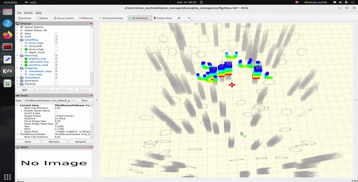

# Fast-Planner ROS2 Migration




基于 [Fast-Planner](https://github.com/HKUST-Aerial-Robotics/Fast-Planner) 的 ROS2 Humble 移植版本，针对 NVIDIA Jetson（aarch64）平台优化，并新增 FastAPI HTTP 接口。

## 主要改动

### 1. ROS2 移植
- 所有 launch 文件从 ROS1 XML 格式转换为 ROS2 Python 格式
- 新增 `kino_replan.launch.py` 和 `topo_replan.launch.py`
- 节点通信从 `rospy` 迁移至 `rclpy`

### 2. 无人机仿真修复
- `odom_visualization`：修复 mesh 模型加载逻辑，改用 `.mesh` 格式，修复 CMakeLists.txt 安装规则
- `simulator.launch.py`：修复无人机初始位置为 `(0, 0, 1)`，修复 mesh 路径配置
- `pointcloud_render_node.cpp`：修复 publisher 使用绝对 topic 名导致 remapping 失效的问题，改为相对名 `rendered_pcl`，使点云正确传入 `sdf_map`

### 3. 规划器修复
- `kino_replan_fsm.cpp`：修复自主规划飞行逻辑
- `traj_server.cpp`：修复轨迹执行
- 规划流程正常：`Triggered → GEN_NEW_TRAJ → EXEC_TRAJ → REPLAN_TRAJ → WAIT_TARGET`

### 4. FastAPI HTTP 接口（`fastapi_planner/`）
新增 REST API 服务，通过 HTTP 控制 Fast-Planner：
- `GET /odometry` — 获取当前无人机位姿
- `POST /plan` — 发送规划目标点
- `POST /map/depth` — 上传深度图更新地图

主要修复：
- `config.py` / `settings.yaml`：将配置文件从 `config.yaml` 改名为 `settings.yaml`，避免与 `config.py` 模块名冲突
- `ros_bridge.py`：修复 `publish_goal()` 参数签名，添加 `get_latest_odometry()` 别名，修复 `timestamp` 类型（`datetime` → `time.time()`），`max_odometry_age` 调整为 5.0 秒

## 快速启动

```bash
# 启动仿真器
ros2 launch so3_quadrotor_simulator simulator.launch.py

# 启动动力学规划
ros2 launch plan_manage kino_replan.launch.py

# 启动可视化
ros2 launch plan_manage rviz.launch.py

# 启动 FastAPI 服务
cd ~/colcon_ws/fastapi_planner && python3 -m main
```

详细命令见 `docs/快速启动命令.md`。

## 运行环境

- Ubuntu 22.04 / ROS2 Humble
- NVIDIA Jetson（aarch64）
- Python 3.10+
